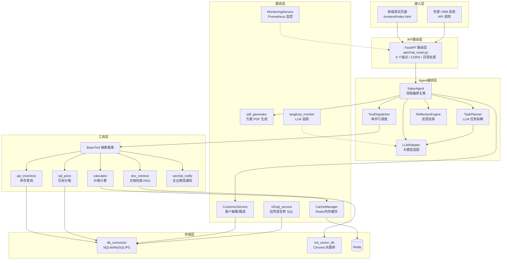
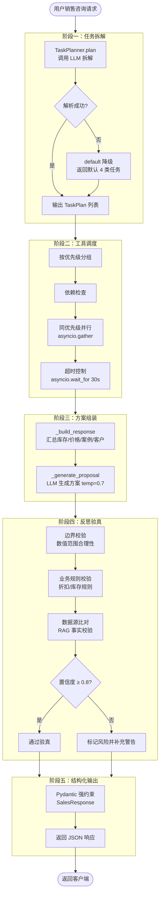
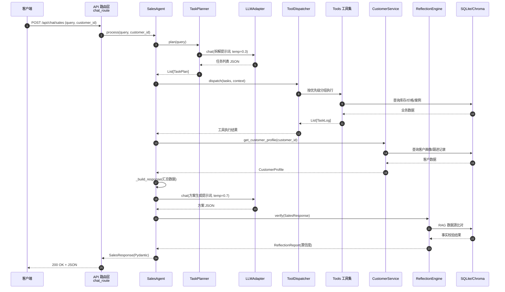
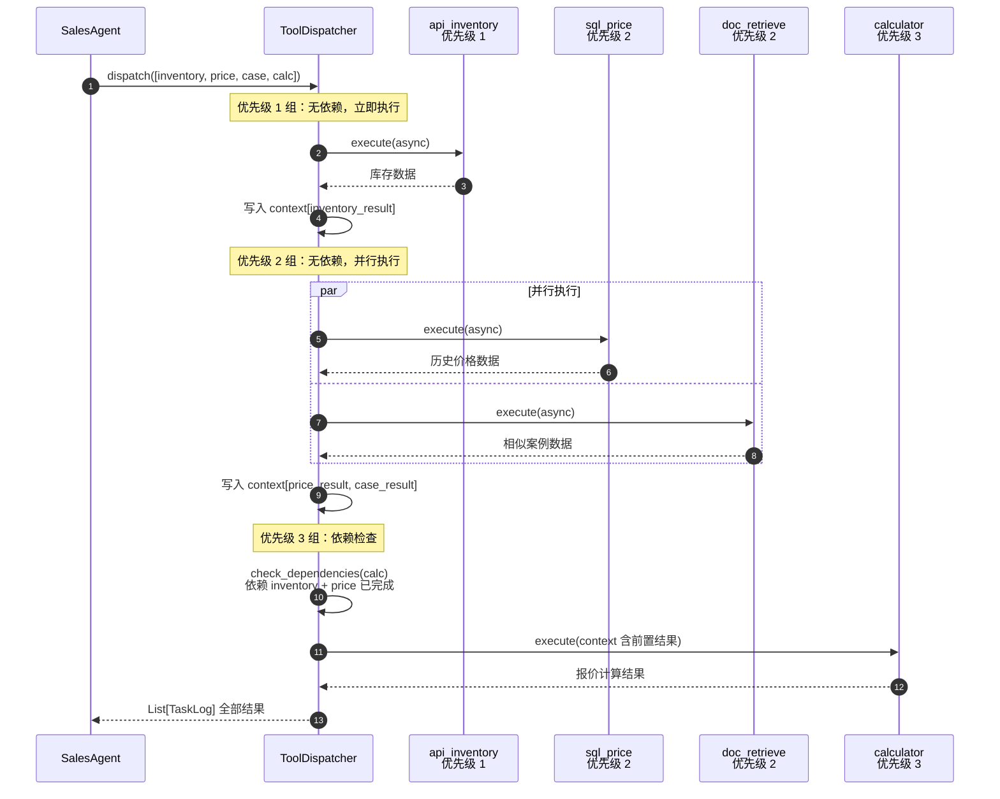
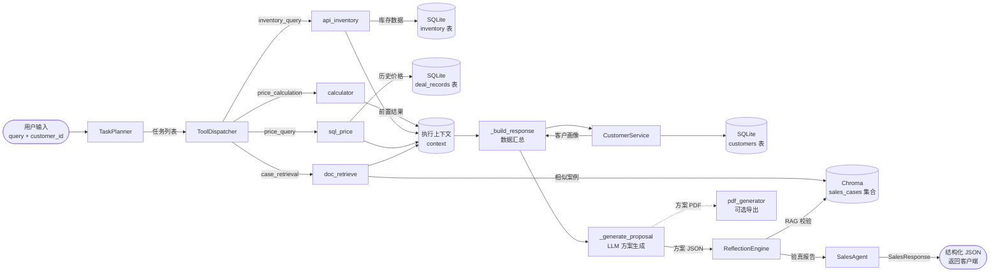
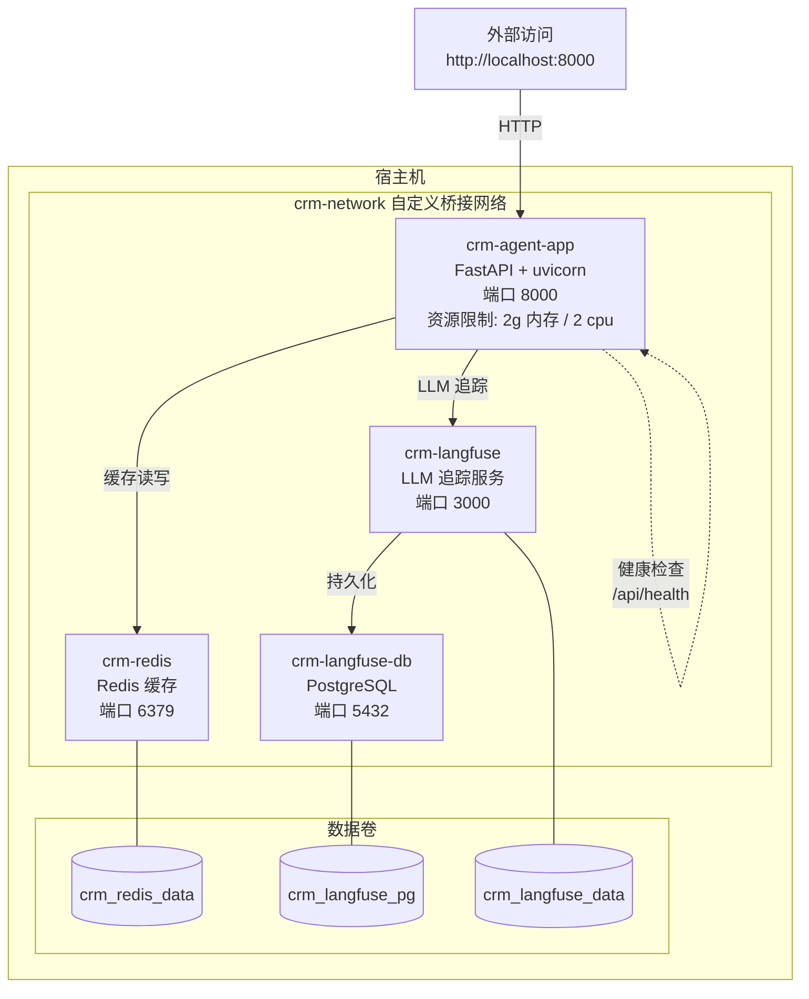
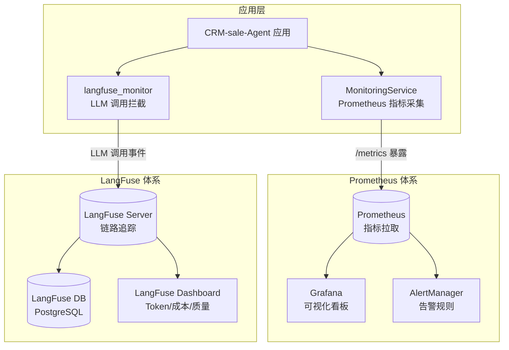

# CRM-sale-Agent 项目架构图文档

> **文档版本**: v1.0
> **创建日期**: 2026-08-17
> **项目名称**: CRM-sale-Agent（可编排多工具销售任务拆解 Agent）
> **文档状态**: 正式发布
> **负责人**: 开发团队

---

## 目录

1. [项目概述](#一项目概述)
2. [系统总体架构图](#二系统总体架构图)
3. [Agent 核心处理流程图](#三agent-核心处理流程图)
4. [模块交互图](#四模块交互图)
5. [工具调度时序图](#五工具调度时序图)
6. [数据流图](#六数据流图)
7. [数据库 ER 图](#七数据库-er-图)
8. [部署架构图](#八部署架构图)
9. [监控架构图](#九监控架构图)
10. [设计模式应用](#十设计模式应用)
11. [附录：术语表](#附录术语表)

---

## 一、项目概述

CRM-sale-Agent 是面向 B2B 实体产品销售场景的智能 Agent 系统。系统以 LLM 驱动的任务拆解为起点，通过多工具串并行调度获取真实业务数据，经 RAG 事实验真后输出结构化、可信的销售方案，目标在 15 秒内完成一次完整的销售咨询响应。

### 技术栈概览

| 层级 | 技术选型 | 说明 |
|------|----------|------|
| 运行时 | Python 3.10+ | 主开发语言 |
| Web 框架 | FastAPI + uvicorn | 异步 API 服务，9 个端点 |
| LLM 编排 | LlamaIndex | RAG 检索与 LLM 调用编排 |
| 向量数据库 | Chroma | 销售案例语义检索 |
| 关系数据库 | SQLite（默认）/ MySQL / PostgreSQL | 产品、库存、成交、客户数据 |
| 缓存 | Redis（可选，降级为内存缓存） | 库存/价格/案例多级缓存 |
| 配置管理 | pydantic-settings | 环境变量与常量统一注入 |
| 监控 | Prometheus + LangFuse | 指标采集与 LLM 链路追踪 |
| 部署 | Docker + docker-compose | 多阶段构建，app + redis + langfuse 编排 |

### 入口与启动链路

`main.py` 为服务启动入口，执行顺序为：`setup_logging()` 配置 loguru 日志 → `initialize_system()` 连接数据库并验证 → `create_app()` 构建 FastAPI 实例 → 挂载前端静态页面 → `uvicorn.run()` 启动服务。配置统一来自 `config/settings.py`，通过 `pydantic-settings` 从环境变量加载。

---

## 二、系统总体架构图

系统采用六层分层架构，自上而下依次为接入层、API 路由层、Agent 编排层、工具层、服务层、存储层。每一层只与相邻层交互，职责边界清晰，便于独立演进与替换。Agent 编排层是整个系统的中枢，向下调度工具与服务获取数据，向上对 API 层返回结构化响应。



接入层通过 HTTP 与 API 路由层通信；API 层将请求委托给 `SalesAgent`；编排层内部 `TaskPlanner` 调 `LLMAdapter` 拆解任务，`ToolDispatcher` 调度工具层执行，`ReflectionEngine` 调 `Chroma` 做 RAG 校验；工具层与服务层共用存储层完成数据读写。监控组件（`MonitoringService`、`langfuse_monitor`）以旁路方式贯穿各层，不阻断主链路。关键设计点：工具层基于 `BaseTool` 抽象基类实现可插拔，新增工具只需继承基类并注册到 `ToolDispatcher`，不影响编排层逻辑。

---

## 三、Agent 核心处理流程图

`SalesAgent.process()` 是系统的核心方法，串行执行五个阶段：任务拆解、工具调度、方案组装、反思验真、结构化输出。每个阶段有明确的输入输出契约与失败降级策略，保证端到端可控。



五个阶段的关键参数：阶段一 `TaskPlanner` 使用 `temperature=0.3` 保证拆解稳定性，并提供 `plan→parse→default` 三级降级链，LLM 解析失败时回退到默认 4 类任务；阶段二通过 `asyncio.wait_for` 设置 30 秒超时，避免单工具阻塞整体响应；阶段三方案生成使用 `temperature=0.7` 以兼顾专业性与表达多样性，提示词中明确约束"绝对不能编造数据"；阶段四的三层校验从数值边界、业务规则、数据源比对三个维度交叉验证，置信度阈值 0.8 为可配置项；阶段五通过 Pydantic Schema 强约束输出结构，保证下游消费者解析成功率。

---

## 四、模块交互图

下图展示一次完整销售咨询从客户端请求到响应返回的调用链路，覆盖 API 路由、Agent 编排、工具执行、LLM 调用、反思验真各模块的协作时序。



调用链路的关键协作点：第 3-5 步任务拆解阶段，`TaskPlanner` 依赖 `LLMAdapter` 完成意图理解，若 LLM 不可用则触发降级返回默认任务；第 6-10 步工具执行阶段，`ToolDispatcher` 统一编排所有工具调用，工具结果写入 `context` 供后续阶段引用；第 11-14 步方案生成阶段，`SalesAgent` 先通过 `CustomerService` 补充客户画像，再调 LLM 生成定制方案；第 15-18 步验真阶段，`ReflectionEngine` 独立访问数据源进行事实比对，与方案生成形成交叉验证，置信度不足时在响应中追加风险警告而非阻断输出。

---

## 五、工具调度时序图

`ToolDispatcher` 的核心调度策略是优先级分组串行、同优先级内并行、跨优先级依赖检查。下图以 4 类任务为例展示分组与并行执行的时序。



调度策略的关键设计点：优先级 1 的库存查询最先执行，因为优先级 3 的报价计算依赖其结果；优先级 2 的价格查询与案例检索无相互依赖，通过 `asyncio.gather` 并行执行以压缩总耗时；优先级 3 的计算工具在执行前由 `_check_dependencies` 校验前置任务是否完成，依赖未满足则直接标记失败并记录错误日志，避免空转等待。超时控制作用于单个工具调用层级，`asyncio.wait_for` 设置 30 秒上限，超时工具被标记失败但不影响其他独立工具的执行结果。

### 任务类型与工具映射

| 任务类型 | 工具 | 优先级 | 依赖 |
|----------|------|--------|------|
| inventory_query | api_inventory | 1 | 无 |
| price_query | sql_price | 2 | 无 |
| case_retrieval | doc_retrieve | 2 | 无 |
| price_calculation | calculator | 3 | inventory_query, price_query |

优先级数值越小越先执行。同优先级任务间无依赖关系，可安全并行；跨优先级任务通过依赖声明形成串行约束，保证数据流的正确顺序。

---

## 六、数据流图

下图展示业务数据在各模块间的流向，从用户输入到最终响应的数据变换路径。数据流的核心特征是：所有方案内容均来自工具获取的真实数据，LLM 只负责组织与表达，不产生新的事实信息。



数据流的三条主线：业务数据线（库存/价格/案例）从关系库与向量库经工具层汇入 `context`；客户数据线由 `CustomerService` 独立查询后注入方案生成阶段；验真数据线由 `ReflectionEngine` 回访 `Chroma` 做事实比对。`calculator` 工具不直接访问数据库，其输入来自 `context` 中前置任务的输出，保证计算基于已校验的真实数据。缓存层（`CacheManager`）旁路作用于工具层，库存数据缓存 3600 秒、价格数据 7200 秒、案例数据 86400 秒，缓存未命中时回源数据库，Redis 不可用时自动降级为进程内存缓存。

---

## 七、数据库 ER 图

系统持久化层包含 6 张关系表（SQLite 默认，可切换 MySQL/PostgreSQL）与 1 个向量集合。关系表覆盖产品、库存、成交、客户、画像、跟进六个业务实体；Chroma 向量集合存储销售案例用于语义检索。

```mermaid
erDiagram
    PRODUCTS ||--|| INVENTORY : 一对一
    PRODUCTS ||--o{ DEAL_RECORDS : 一对多
    CUSTOMERS ||--o{ DEAL_RECORDS : 一对多
    CUSTOMERS ||--|| CUSTOMER_PROFILES : 一对一
    CUSTOMERS ||--o{ FOLLOW_UP_RECORDS : 一对多

    PRODUCTS {
        integer id PK
        string product_sku PK_UK
        string product_name
        string category
        real base_price
        string unit
        string description
        text created_at
        text updated_at
    }

    INVENTORY {
        integer id PK
        string product_sku PK_UK_FK
        string product_name
        integer stock_quantity
        integer available_quantity
        integer reserved_quantity
        string lead_time
        string warehouse_location
        string unit
        text updated_at
    }

    DEAL_RECORDS {
        integer id PK
        string deal_id PK_UK
        string product_sku FK
        string product_name
        string customer_id FK
        string customer_name
        string industry
        integer quantity
        real unit_price
        real total_amount
        real discount_rate
        string payment_terms
        string deal_date
        string sales_person
        string notes
        text created_at
    }

    CUSTOMERS {
        integer id PK
        string customer_id PK_UK
        string customer_name
        string industry
        string contact_person
        string contact_phone
        string address
        string credit_level
        text created_at
        text updated_at
    }

    CUSTOMER_PROFILES {
        string customer_id PK_FK
        string company_size
        string customer_level
        real total_purchase_amount
        integer purchase_count
        string last_purchase_date
        string credit_rating
        string tags
        text created_at
        text updated_at
    }

    FOLLOW_UP_RECORDS {
        string record_id PK
        string customer_id FK
        string follow_up_type
        string content
        string result
        string next_follow_up_date
        string created_by
        text created_at
    }
```

表关系设计要点：`products` 与 `inventory` 通过 `product_sku` 建立 1:1 关联，库存表冗余存储 `product_name` 以减少联表查询；`deal_records` 同时引用 `product_sku` 与 `customer_id`，是连接产品与客户的核心事实表，包含数量、单价、总额、折扣率、付款条件等成交维度；`customer_profiles` 是 `customers` 的扩展画像，1:1 关联，存储采购汇总金额、采购次数、信用评级等聚合字段；`follow_up_records` 以 1:N 关联客户，记录 call/meeting/email/wechat 等跟进类型。所有表通过 `init_sql.py` 自动建表并写入模拟数据，`db_connector.py` 以单例模式管理连接，支持按 `DB_TYPE` 配置切换 SQLite/MySQL/PostgreSQL。

### Chroma 向量集合

| 集合名称 | 用途 | 检索方式 |
|----------|------|----------|
| sales_cases | 存储历史销售案例的向量化文本 | 语义相似度检索（cosine） |

`init_vector_db.py` 负责初始化 Chroma 集合，`doc_retrieve` 工具将查询文本 embedding 后在 `sales_cases` 中检索相似案例，检索结果同时用于方案生成（提供参考案例）与反思验真（事实比对数据源）。

---

## 八、部署架构图

系统通过 Docker 多阶段构建生成镜像，docker-compose 编排四个容器协同运行。容器间通过自定义网络通信，数据通过命名卷持久化，资源限制保证单容器不抢占主机资源。



部署架构的关键配置：`app` 容器基于 `python:3.10-slim` 多阶段构建，第一阶段安装编译依赖，第二阶段仅拷贝运行时产物，镜像体积更小；`redis` 容器为可选组件，未配置时 `CacheManager` 自动降级为进程内存缓存；`langfuse` 与 `langfuse-db` 为可选监控 profile，通过 compose profile 控制是否启用，不影响主应用启动；所有容器通过 `crm-network` 桥接网络互通，仅 `app` 暴露 8000 端口对外；`app` 容器配置 `deploy.resources.limits`（2g 内存 / 2 cpu）防止单点资源耗尽，并配置 `/api/health` 健康检查实现自愈重启；三个命名卷分别持久化 Redis 数据、LangFuse PostgreSQL 数据、LangFuse 运行数据，保证容器重建后数据不丢失。

---

## 九、监控架构图

系统采用双监控体系：Prometheus 负责传统指标采集与告警，LangFuse 负责 LLM 调用链路的深度追踪。两者互补，前者覆盖系统运行健康度，后者聚焦 LLM 成本与质量。



### Prometheus 指标覆盖

| 指标类别 | 采集内容 | 用途 |
|----------|----------|------|
| 请求指标 | API 请求量、响应耗时、状态码分布 | 接口健康度监控 |
| 工具指标 | 各工具调用次数、成功率、执行耗时 | 工具可用性分析 |
| LLM 指标 | LLM 调用次数、耗时、失败率 | 模型服务稳定性 |
| 反思指标 | 验真通过率、置信度分布 | 输出质量监控 |
| 缓存指标 | 缓存命中率、未命中回源次数 | 缓存策略评估 |
| 客户指标 | 客户画像查询次数、跟进记录写入量 | 业务活跃度 |
| 健康指标 | 数据库连接状态、向量库可用性 | 基础设施巡检 |

### LangFuse 追踪维度

| 追踪维度 | 采集内容 | 分析价值 |
|----------|----------|----------|
| 调用链路 | TaskPlanner→LLM→ToolDispatcher→Reflection 全链路 span | 定位耗时瓶颈与异常环节 |
| Token 用量 | 每次请求的 prompt/completion token 数 | 成本核算与预算控制 |
| 成本分析 | 按 LLM 模型计价折算费用 | 多模型成本对比与优化 |
| 质量评分 | 反思验真置信度与人工评分 | 模型输出质量趋势分析 |

`MonitoringService` 以单例模式运行，通过 `/metrics` 端点暴露 Prometheus 格式指标；`langfuse_monitor` 拦截 `LLMAdapter` 的每次调用，将 prompt、completion、token、耗时作为 trace span 上报 LangFuse Server。两者均以旁路方式工作，监控组件异常不影响主业务链路。

---

## 十、设计模式应用

系统在关键模块有意识地应用了经典设计模式，以解耦职责边界并提升可扩展性。

| 设计模式 | 应用位置 | 解决的问题 |
|----------|----------|------------|
| 适配器模式 | `LLMAdapter` | 统一 OpenAI 与 Qwen 等不同模型的调用接口，上层不感知底层模型差异 |
| 策略模式 | `BaseTool` 抽象基类 + 5 个工具实现 | 工具行为可替换，`ToolDispatcher` 只依赖抽象接口 |
| 单例模式 | `DatabaseConnector` / `LLMAdapter` / `CustomerService` / `CacheManager` | 全局唯一实例，避免重复创建连接与配置加载 |
| 模板方法 | `TaskPlanner` 的 plan→parse→default 降级链 | 固定执行骨架，子步骤可按场景降级 |
| 工厂方法 | `get_agent()` / `get_llm()` / `get_db_connector()` | 封装实例创建逻辑，调用方不感知构造细节 |

设计模式选型遵循"不过度设计"原则：工具层用策略模式是因为工具数量多且行为可替换，收益明确；而简单的数据模型类（如 `CustomerProfile`）未强行套用工厂模式，保持直接实例化的简洁性。

---

## 附录：术语表

| 术语 | 说明 |
|------|------|
| Agent | 本文中指基于 LLM 的智能体，能自主拆解任务、调用工具、反思验真并输出结构化结果 |
| TaskPlanner | 任务拆解器，将自然语言咨询通过 LLM 转换为结构化任务列表 |
| ToolDispatcher | 工具调度器，按优先级与依赖关系编排工具的串并行执行 |
| ReflectionEngine | 反思验真引擎，对 Agent 输出做数值边界、业务规则、数据源比对三层校验 |
| LLMAdapter | 大模型适配器，以适配器模式统一不同 LLM 供应商的调用接口 |
| RAG | Retrieval-Augmented Generation，检索增强生成，通过向量检索引入外部知识降低幻觉 |
| Chroma | 开源向量数据库，本文中存储销售案例的向量化文本供语义检索 |
| Pydantic | Python 数据校验库，本文中用于定义输入输出 Schema 以强约束 JSON 结构 |
| asyncio.gather | Python 异步并发原语，并发执行多个协程并等待全部完成 |
| asyncio.wait_for | Python 异步超时控制原语，为协程执行设置时间上限 |
| 置信度阈值 | 反思验真阶段的质量门槛，默认 0.8，低于则标记风险 |
| NL2SQL | Natural Language to SQL，将自然语言转换为可执行 SQL 查询 |
| LangFuse | 开源 LLM 可观测性平台，提供调用链路追踪、Token 用量与成本分析 |
| Prometheus | 开源监控与告警系统，通过时序数据库存储与查询指标 |
| BaseTool | 工具抽象基类，定义工具的统一接口契约，具体工具继承实现 |
| SalesResponse | 销售响应的 Pydantic Schema，强约束返回给客户端的 JSON 结构 |
| crm-network | docker-compose 定义的自定义桥接网络，容器间通过该网络通信 |
| 降级链 | 当主流程异常时按预定义顺序回退到备选方案的机制，如 TaskPlanner 的 plan→parse→default |
